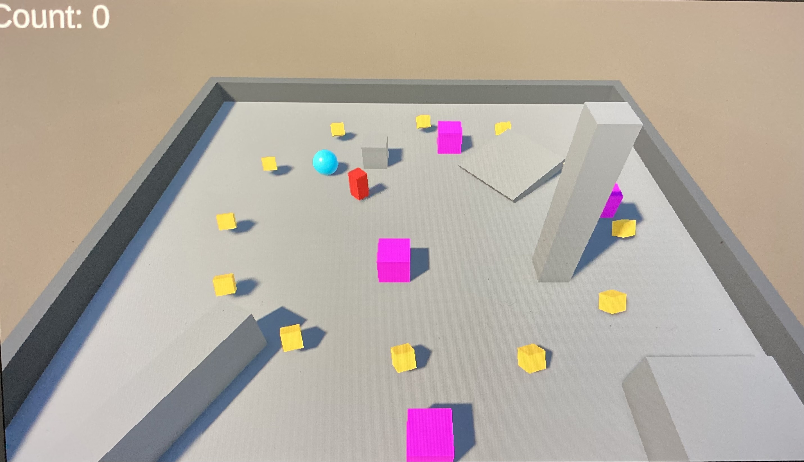

## 🧩 Roll-a-Ball Extended

My first Unity project, built while learning C# and game development fundamentals.  
I started from the classic “Roll-a-Ball” Unity tutorial and expanded it with new gameplay and UI systems.  

---

### 🎮 Features

- Win/Lose system: Detects victory or defeat conditions  
- Dynamic UI: Displays *You Win!* / *You Lose!* messages  
- Game Manager: Handles delayed pop-up logic and restart flow  
- Restart button: Replay instantly via button or Enter key  
- Clean code: Separated game logic and user interface (GameManager pattern)  

---

### 🧠 What I learned

- C# scripting basics (methods, variables, and conditions)  
- Unity components and GameObjects  
- Communication between scripts (`PlayerController ↔ GameManager`)  
- Event handling with UI and the Unity EventSystem  
- Using Git and GitHub for version control  

---

### 🚀 How to play

1. Clone or download the project  
2. Open in Unity 2022+  
3. Press Play — move with WASD or arrow keys  
4. Collect all pickups to win. Avoid enemies to stay alive.  
