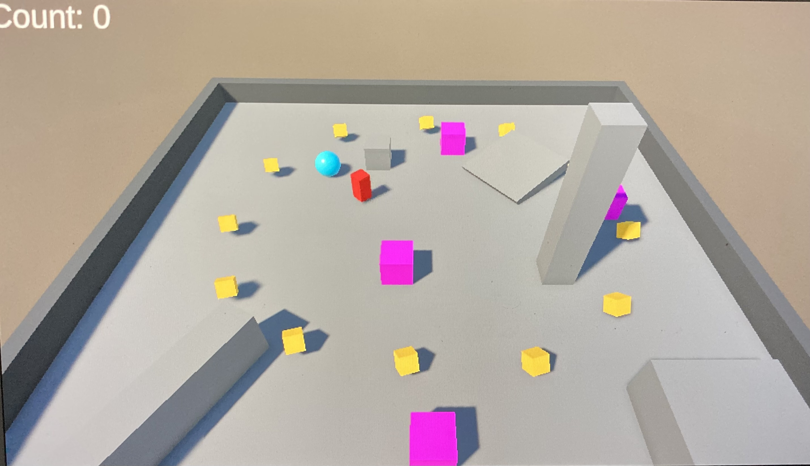

## 🧩 Roll-a-Ball Extended

## ▶ Play in Browser (no setup)
https://malte95.github.io/Roll-a-ball/

> Click inside the game window to focus controls (W/A/S/D or Arrow Keys).

My first Unity project, built while learning C# and game development fundamentals.  
This project is based on the classic **Roll-a-Ball** tutorial from **Unity Learn**.  
I extended the tutorial by adding a **“Play again?” feature**, allowing the player to restart the game after winning or losing without reloading the scene manually.

The restart flow is handled via a central **GameManager**, which controls game state, UI messages, and input handling.

---

### 🎮 Features

- Win/Lose system: Detects victory or defeat conditions  
- Dynamic UI: Displays *You Win!* / *You Lose!* messages  
- Game Manager: Handles delayed pop-up logic and restart flow  
- **Play again feature**: Restart the game via button or Enter key  
- Clean code: Separated game logic and user interface (GameManager pattern)  

---

### 🧠 What I learned

- C# scripting basics (methods, variables, and conditions)  
- Unity components and GameObjects  
- Communication between scripts (`PlayerController ↔ GameManager`)  
- Event handling with UI and the Unity EventSystem  
- Extending a tutorial with custom gameplay features  
- Using Git and GitHub for version control  

---

### 🚀 How to play

1. Clone or download the project  
2. Open in Unity 2022+  
3. Press Play — move with WASD or arrow keys  
4. Collect all pickups to win. Avoid enemies to stay alive.  

